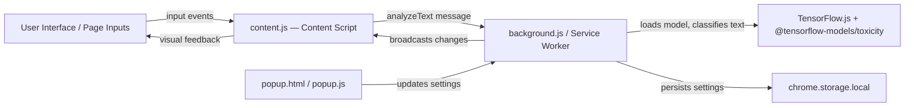
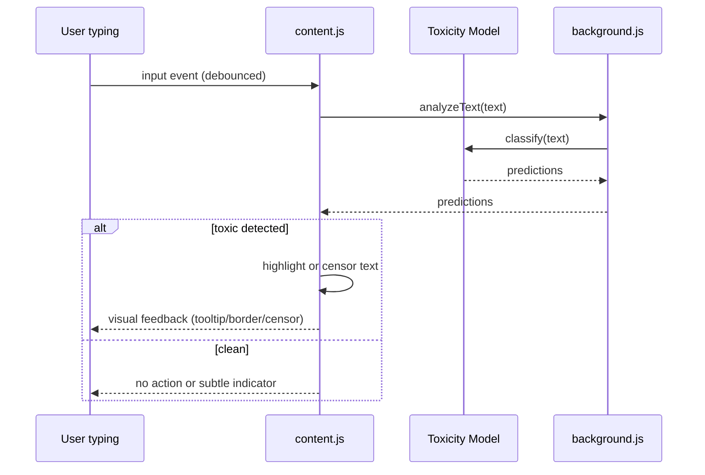
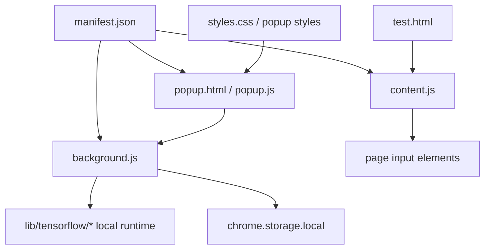
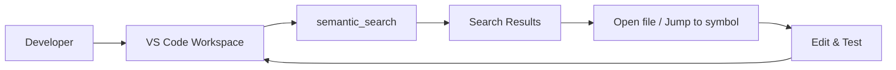

# 🛡️ Toxic Shield

A privacy-forward browser extension that detects and optionally censors toxic language in real-time using TensorFlow.js and the `@tensorflow-models/toxicity` model.

---

## Table of Contents

- [🛡️ Toxic Shield](#️-toxic-shield)
  - [Table of Contents](#table-of-contents)
  - [Project Overview](#project-overview)
  - [Quick Start (PowerShell)](#quick-start-powershell)
  - [Architecture \& Diagrams](#architecture--diagrams)
    - [Architecture Overview (Mermaid)](#architecture-overview-mermaid)
    - [Detection Sequence (Mermaid)](#detection-sequence-mermaid)
    - [Component Map (Mermaid)](#component-map-mermaid)
    - [Developer: semantic\_search workflow (Mermaid)](#developer-semantic_search-workflow-mermaid)
  - [Folder Structure](#folder-structure)
  - [Development \& Validation](#development--validation)
  - [Contributing](#contributing)
  - [License](#license)

---

## Project Overview

Toxic Shield is a cross-browser Manifest V3 extension that:

- Loads the bundled TensorFlow.js runtime and toxicity wrapper from `lib/tensorflow/` inside the background service worker.
- Downloads the toxicity model weights from TF Hub the first time the model loads; classification itself runs locally, so the text being checked never leaves the browser.
- Monitors text inputs, textareas and contenteditable elements for toxic content.
- Highlights or auto-censors offensive content depending on user settings.
- Exposes a popup UI for toggling detection and auto-censoring.

Key files:

- `manifest.json` — Extension registration and content script loading
- `background.js` — Service worker (install defaults, injects content script, loads the model and runs classification)
- `content.js` — Watches page inputs and sends their text to the service worker for classification
- `popup.html` / `popup.js` — Settings UI
- `lib/tensorflow/*` — Local TensorFlow.js runtime and toxicity wrapper (the model weights themselves are fetched from TF Hub at runtime)
- `test.html` — Local test harness for debugging


## Quick Start (PowerShell)

Clone, install (if needed), and load the extension in developer mode:

```powershell
# Clone the repo
git clone https://github.com/Life-Experimentalist/ToxicGuard_AI.git ; cd ToxicGuard_AI

# (Optional) Re-download the TensorFlow.js runtime files into lib/tensorflow/
node scripts/setup.js

# Load the folder as an unpacked extension in your browser:
# Chrome/Edge: open chrome://extensions and "Load unpacked"
# Firefox: open about:debugging → This Firefox → Load Temporary Add-on
```

Notes: The above commands are PowerShell examples. When giving commands in Windows follow PowerShell syntax.

---

## Architecture & Diagrams

### Architecture Overview (Mermaid)


```mermaid
flowchart LR
  UI[User Interface / Page Inputs]
  CS[content.js — Content Script]
  MODEL[TensorFlow.js + @tensorflow-models/toxicity]
  BG[background.js / Service Worker]
  STORAGE[chrome.storage.local]
  POPUP[popup.html / popup.js]

  UI -->|input events| CS
  CS -->|analyzeText message| BG
  BG -->|loads model, classifies text| MODEL
  BG -->|persists settings| STORAGE
  POPUP -->|updates settings| BG
  BG -->|broadcasts changes| CS
  CS -->|visual feedback| UI
```

Elements and single-line explanations:

- UI — The web page elements (input, textarea, contenteditable) that users interact with.
- CS — `content.js`, injected into pages; observes inputs, debounces events and forwards text to the service worker.
- MODEL — TensorFlow.js runtime and `@tensorflow-models/toxicity` classifier performing predictions.
- BG — `background.js`, service worker that loads the model, runs classification, and manages defaults and messaging.
- STORAGE — `chrome.storage.local` where user preferences and thresholds are persisted.
- POPUP — `popup.html / popup.js`, the extension settings UI that modifies preferences.


### Detection Sequence (Mermaid)


```mermaid
sequenceDiagram
  participant User as User typing
  participant CS as content.js
  participant Model as Toxicity Model
  participant BG as background.js

  User->>CS: input event (debounced)
  CS->>BG: analyzeText(text)
  BG->>Model: classify(text)
  Model-->>BG: predictions
  BG-->>CS: predictions
  alt toxic detected
    CS->>CS: highlight or censor text
    CS-->>User: visual feedback (tooltip/border/censor)
  else clean
    CS-->>User: no action or subtle indicator
  end
```

Elements and single-line explanations:

- User — Person typing or pasting text into page inputs.
- CS — `content.js`, which debounces, prepares text, and sends it to the service worker.
- Model — The toxicity classifier returning per-category predictions and probabilities.
- BG — `background.js`, loads the model, classifies the text it is sent, stores settings and broadcasts config.


### Component Map (Mermaid)


```mermaid
graph TD
  M[manifest.json]
  BG_FILE[background.js]
  CS_FILE[content.js]
  POPUP[popup.html / popup.js]
  LIB[lib/tensorflow/* local runtime]
  UI[page input elements]
  TEST[test.html]
  CSS[styles.css / popup styles]

  M --> BG_FILE
  M --> CS_FILE
  M --> POPUP
  BG_FILE --> LIB
  CS_FILE --> UI
  POPUP --> BG_FILE
  BG_FILE --> STORAGE[chrome.storage.local]
  TEST --> CS_FILE
  CSS --> POPUP
```

Elements and single-line explanations:

- manifest.json — Declares permissions, content scripts, and web_accessible_resources.
- background.js — Loads the model, classifies text on request, bootstraps default settings and handles storage.
- content.js — Runs in page context, inspects user input and sends it to the service worker for classification.
- popup.html / popup.js — Settings UI to enable/disable detection and tweak thresholds.
- lib/tensorflow/* — Local runtime assets (tf.min.js, toxicity.min.js) imported by the service worker; the model weights are fetched from TF Hub.
- page input elements — Inputs, textareas, and contenteditable regions targeted by content.js.
- test.html — Developer test harness to exercise inputs, shadow DOM, iframes and dynamic nodes.
- styles.css — Shared styling for popup/test UI.


### Developer: semantic_search workflow (Mermaid)


```mermaid
flowchart LR
  Dev[Developer]
  VS[VS Code Workspace]
  SSEARCH[semantic_search]
  RESULTS[Search Results]
  OPEN[Open file / Jump to symbol]
  EDIT[Edit & Test]

  Dev --> VS
  VS --> SSEARCH
  SSEARCH --> RESULTS
  RESULTS --> OPEN
  OPEN --> EDIT
  EDIT --> VS
```

Elements and single-line explanations:

- Dev — The developer working on the project in their editor.
- VS — Visual Studio Code workspace containing the extension source.
- semantic_search — The code search utility used to quickly find symbols or code paths.
- RESULTS — The matched files, lines or symbols returned by the search.
- OPEN — Action to open the matched file and navigate to the exact line or symbol.
- EDIT — Developer modifies code, then runs local tests or loads the extension for validation.


## Folder Structure

```
ToxicGuard_AI/
├─ background.js
├─ content.js
├─ popup.html
├─ popup.js
├─ manifest.json
├─ manifest-v3.json (compat / alternate)
├─ lib/
│  └─ tensorflow/
│     ├─ tf.min.js
│     └─ toxicity.min.js
├─ test.html
├─ setup.js
├─ script.js (shared dictionaries/helpers)
├─ styles.css
└─ icons/
   ├─ icon16.png
   └─ icon128.png
```


## Development & Validation

- Use PowerShell commands shown in Quick Start.
- `scripts/setup.js` re-downloads the TensorFlow.js runtime files into `lib/tensorflow/`. It does not fetch the model weights; those are downloaded from TF Hub when the extension loads the model.
- Validate cross-browser manifest compatibility before publishing.

Recommended workflow:

```powershell
# Re-download the TensorFlow.js runtime files (optional)
node scripts/setup.js

# Load in browser for local testing (use the browser developer extension UI)
# Use test.html to exercise input scenarios
```


## Contributing

Please follow the contribution guidelines in `.github/CONTRIBUTING.md`. Keep changes small, document behavior and test the extension on Chromium and Firefox.


## [License](LICENSE.md)

This project uses the Apache-2.0 license for included TFJS assets (see individual files) and the repository's LICENSE file if present.
