# 🛡️ Toxic Shield (ToxicGuard AI)

A privacy-forward browser extension that detects and optionally censors toxic language in real-time using TensorFlow.js and the `@tensorflow-models/toxicity` model.

---

## Table of Contents

- [Project Overview](#project-overview)
- [Quick Start (PowerShell)](#quick-start-powershell)
- [Architecture & Diagrams](#architecture--diagrams)
  - [Architecture Overview (Mermaid)](#architecture-overview-mermaid)
  - [Detection Sequence (Mermaid)](#detection-sequence-mermaid)
  - [Component Map (Mermaid)](#component-map-mermaid)
  - [Developer: semantic_search workflow (Mermaid)](#developer-semantic_search-workflow-mermaid)
- [Folder Structure](#folder-structure)
- [Development & Validation](#development--validation)
- [Contributing](#contributing)
- [License](#license)

---

## Project Overview

Toxic Shield (aka ToxicGuard AI) is a cross-browser Manifest V3 extension that:

- Loads a local copy or CDN copy of TensorFlow.js and the toxicity model in content scripts.
- Monitors text inputs, textareas and contenteditable elements for toxic content.
- Highlights or auto-censors offensive content depending on user settings.
- Exposes a popup UI for toggling detection and auto-censoring.

Key files:

- `manifest.json` — Extension registration and content script loading
- `background.js` — Service worker (install defaults, injects content script, routes messages)
- `content.js` — Detection engine loaded into web pages
- `popup.html` / `popup.js` — Settings UI
- `lib/tensorflow/*` — Optional local TFJS + toxicity model assets (fallback to CDN)
- `test.html` — Local test harness for debugging


## Quick Start (PowerShell)

Clone, install (if needed), and load the extension in developer mode:

```powershell
# Clone the repo
git clone https://github.com/Life-Experimentalists/ToxicGuard_AI.git ; cd ToxicGuard_AI

# (Optional) Download local TFJS assets if you prefer offline usage
node setup.js

# Load the folder as an unpacked extension in your browser:
# Chrome/Edge: open chrome://extensions and "Load unpacked"
# Firefox: open about:debugging → This Firefox → Load Temporary Add-on
```

Notes: The above commands are PowerShell examples. When giving commands in Windows follow PowerShell syntax.

---

## Architecture & Diagrams

### Architecture Overview (Mermaid)

```mermaid
flowchart LR
  UI[User Interface / Page Inputs]
  CS[content.js — Content Script]
  MODEL[TensorFlow.js + @tensorflow-models/toxicity]
  BG[background.js / Service Worker]
  STORAGE[chrome.storage.local]
  POPUP[popup.html / popup.js]

  UI -->|input events| CS
  CS -->|loads model| MODEL
  CS -->|sends settings / telemetry| BG
  BG -->|persists settings| STORAGE
  POPUP -->|updates settings| BG
  BG -->|broadcasts changes| CS
  CS -->|visual feedback| UI
```



Elements and single-line explanations:

- UI — The web page elements (input, textarea, contenteditable) that users interact with.
- CS — `content.js`, injected into pages; observes inputs, debounces events and runs detection.
- MODEL — TensorFlow.js runtime and `@tensorflow-models/toxicity` classifier performing predictions.
- BG — `background.js`, service worker that manages defaults, messaging, and cross-tab sync.
- STORAGE — `chrome.storage.local` where user preferences and thresholds are persisted.
- POPUP — `popup.html / popup.js`, the extension settings UI that modifies preferences.


### Detection Sequence (Mermaid)


Elements and single-line explanations:

- User — Person typing or pasting text into page inputs.
- CS — `content.js`, which debounces, prepares text, and runs classification.
- Model — The toxicity classifier returning per-category predictions and probabilities.
- BG — `background.js`, receives optional telemetry, stores settings, and broadcasts config.


### Component Map (Mermaid)


Elements and single-line explanations:

- manifest.json — Declares permissions, content scripts, and web_accessible_resources.
- background.js — Bootstraps default settings, handles messaging and storage interactions.
- content.js — Runs in page context, loads model and inspects user input for toxicity.
- popup.html / popup.js — Settings UI to enable/disable detection and tweak thresholds.
- lib/tensorflow/* — Local static assets (tf.min.js, toxicity.min.js) used when offline.
- page input elements — Inputs, textareas, and contenteditable regions targeted by content.js.
- test.html — Developer test harness to exercise inputs, shadow DOM, iframes and dynamic nodes.
- styles.css — Shared styling for popup/test UI.


### Developer: semantic_search workflow (Mermaid)


Elements and single-line explanations:

- Dev — The developer working on the project in their editor.
- VS — Visual Studio Code workspace containing the extension source.
- semantic_search — The code search utility used to quickly find symbols or code paths.
- RESULTS — The matched files, lines or symbols returned by the search.
- OPEN — Action to open the matched file and navigate to the exact line or symbol.
- EDIT — Developer modifies code, then runs local tests or loads the extension for validation.


## Folder Structure

```
ToxicGuard_AI/
├─ background.js
├─ content.js
├─ popup.html
├─ popup.js
├─ manifest.json
├─ manifest-v3.json (compat / alternate)
├─ lib/
│  └─ tensorflow/
│     ├─ tf.min.js
│     └─ toxicity.min.js
├─ test.html
├─ setup.js
├─ script.js (shared dictionaries/helpers)
├─ styles.css
└─ icons/
   ├─ icon16.png
   └─ icon128.png
```


## Development & Validation

- Use PowerShell commands shown in Quick Start.
- `setup.js` will download TFJS assets into `lib/tensorflow` when run with Node.js.
- Validate cross-browser manifest compatibility before publishing.

Recommended workflow:

```powershell
# Download TFJS locally (optional)
node setup.js

# Load in browser for local testing (use the browser developer extension UI)
# Use test.html to exercise input scenarios
```


## Contributing

Please follow the contribution guidelines in `.github/CONTRIBUTING.md`. Keep changes small, document behavior and test the extension on Chromium and Firefox.


## License

This project uses the Apache-2.0 license for included TFJS assets (see individual files) and the repository's LICENSE file if present.
