# 🛡️ ToxiGuard AI

> A smart, privacy-respecting browser extension that flags, explains, and optionally censors toxic language in real-time.

ToxiGuard AI uses TensorFlow.js and the `toxicity` NLP model to detect harmful or offensive content while you're typing on any website.

---

## 🚀 Features

- 🔍 **Real-time toxicity detection** in text inputs, textareas, and contenteditable elements
- 🎯 **Fine-grain category controls** - Enable/disable specific toxicity types
- 🧠 **Smart categorization** - Highlights specific toxicity categories (insult, threat, obscene, etc.)
- 😶 **Visual feedback system** - Emoji indicators and border highlighting
- ✅ **Auto-censor functionality** - Optionally replaces toxic content with asterisks
- ⚙️ **Adjustable sensitivity** - Customizable detection threshold (0.1 - 1.0)
- 🧰 **Advanced popup controls** - Toggle detection and configure all settings
- ⌨️ **Keyboard shortcuts** - Alt+T to quickly toggle detection
- 💾 **Persistent settings** - Your preferences are saved automatically
- 🛡️ **Cross-browser compatible** - Works on Chrome, Edge, and Firefox (Manifest V3)
- 🎨 **Modern UI** - Beautiful, intuitive interface with smooth animations

---

## 🛠️ Installation

1. Clone this repository or [Download ZIP](https://github.com/VKrishna04/ToxicGuard_AI/archive/main.zip)
   ```powershell
   git clone https://github.com/VKrishna04/ToxicGuard_AI.git
   cd ToxicGuard_AI
   ```

2. Go to your browser's extensions page:
   - **Chrome**: `chrome://extensions`
   - **Edge**: `edge://extensions`
   - **Firefox**: `about:debugging` → **This Firefox**

3. Enable **Developer Mode** (top-right toggle)

4. Click **Load unpacked** and select the `ToxicGuard_AI/` folder

5. The extension icon should appear in your toolbar

---

## 💡 How It Works

```mermaid
flowchart TD
    A[User types into a text field] --> B[Content script detects input]
    B --> C{Detection enabled?}
    C -->|No| D[Skip processing]
    C -->|Yes| E[Load TensorFlow.js model]
    E --> F[Classify text with enabled categories]
    F --> G{Toxic content detected?}
    G -->|Yes| H[Show red border + tooltip]
    G -->|No| I[Show clean state]
    H --> J{Auto-censor enabled?}
    J -->|Yes| K[Replace toxic words with ***]
    J -->|No| L[Keep original text]
    H --> M[Update emoji indicator to 😠]
    I --> N[Update emoji indicator to 😊]
```



---

## 🧪 Testing the Extension

1. **Open the test page**: Load `test.html` in your browser
2. **Try these examples**:

   **Safe content:**
   - `Hello, how are you doing today?`
   - `This is a great project, keep up the good work!`
   - `I love learning new things about technology`

   **Toxic content:**
   - `You're an idiot`
   - `This is shit`
   - `I hate you so much`

3. **Watch for feedback**:
   - 🔴 Red borders around toxic inputs
   - 💬 Tooltips showing detected categories
   - 😊/😠 Emoji indicator (bottom-right)
   - ⭐ Auto-censoring (if enabled)

---

## ⚙️ Settings & Controls

### Main Controls
- **🔘 Enable Detection** – Master on/off switch
- **🔘 Auto Censor** – Replace toxic words with asterisks

### Sensitivity Settings
- **🎚️ Detection Threshold** – Adjustable from 0.1 (very sensitive) to 1.0 (less sensitive)
- **Default**: 0.9 (recommended for balanced detection)

### Toxicity Categories
Fine-tune which types of content to detect:

| Category              | Icon  | Description                                 |
| --------------------- | ----- | ------------------------------------------- |
| **Insults**           | 🤬    | Personal attacks and offensive name-calling |
| **Obscene**           | 🔞    | Profanity and vulgar language               |
| **Threats**           | ⚔️    | Threatening language and intimidation       |
| **Identity Attacks**  | 🎯    | Attacks based on identity/group membership  |
| **Sexually Explicit** | 🔞    | Sexual content and explicit material        |
| **Severe Toxicity**   | 💀    | Extremely harmful and toxic content         |

### Keyboard Shortcuts
- **Alt + T** – Quick toggle detection on/off

---

## 🧠 Technical Details

### Model Information
- **Framework**: [TensorFlow.js](https://js.tensorflow.org/)
- **Model**: [`@tensorflow-models/toxicity`](https://github.com/tensorflow/tfjs-models/tree/master/toxicity)
- **Architecture**: Pre-trained transformer model
- **Categories**: 6 distinct toxicity types
- **Performance**: ~500ms initial load, <100ms per classification

### Architecture
```
📁 ToxicGuard_AI/
├── 📄 manifest.json      # Extension configuration
├── 📄 background.js      # Service worker (settings, shortcuts)
├── 📄 content.js         # Main detection logic
├── 📄 popup.html         # Settings interface
├── 📄 popup.js           # Popup functionality
├── 📄 test.html          # Testing page
├── 📁 icons/             # Extension icons
└── 📄 README.md          # This file
```

### Browser Compatibility
| Browser | Version | Status                         |
| ------- | ------- | ------------------------------ |
| Chrome  | 88+     | ✅ Full support                |
| Edge    | 88+     | ✅ Full support                |
| Firefox | 109+    | ✅ Full support                |
| Safari  | -       | ❌ Not supported (Manifest V3) |

---

## 🔧 Development

### Setup for Development
```powershell
# Clone the repository
git clone https://github.com/VKrishna04/ToxicGuard_AI.git
cd ToxicGuard_AI

# Install development dependencies (if any)
# Currently uses CDN imports, no build process needed

# Load in browser for testing
# Follow installation steps above
```

### Testing
1. **Load extension** in developer mode
2. **Open test.html** for comprehensive testing
3. **Check console** for debug information
4. **Test on real websites** like Reddit, Twitter, etc.

### Contributing
1. Fork the repository
2. Create a feature branch: `git checkout -b feature-name`
3. Make your changes
4. Test thoroughly
5. Submit a pull request

---

## 🚧 Future Enhancements

- 🌍 **Multilingual support** - Detect toxicity in multiple languages
- 🧑‍🎓 **Educational tooltips** - Explain why content is considered toxic
- 📊 **Statistics dashboard** - Track toxicity patterns over time
- 🔄 **AI-powered suggestions** - Suggest alternative, positive phrasing
- 🌐 **Website-specific settings** - Custom rules for different sites
- 📱 **Mobile browser support** - Extend to mobile browsers
- 🤖 **Custom model training** - Fine-tune for specific use cases
- 🔒 **Privacy enhancements** - Local-only processing options

---

## 📊 Performance

- **Model size**: ~25MB (loaded once per session)
- **Memory usage**: ~50MB RAM
- **Processing time**: 50-200ms per text classification
- **Debounce delay**: 500ms (configurable)
- **Battery impact**: Minimal (only processes on user input)

---

## 🛡️ Privacy & Security

- ✅ **No data collection** - Everything runs locally
- ✅ **No external API calls** - Uses browser-native TensorFlow.js
- ✅ **No user tracking** - No analytics or telemetry
- ✅ **Open source** - Code is fully auditable
- ✅ **Minimal permissions** - Only storage and notifications

---

## 🖼️ Screenshots

### Extension Popup


### Detection in Action
*Red borders appear around toxic content with category tooltips*

### Settings Panel
*Fine-grain controls for each toxicity category*

---

## ⚖️ License

This project is licensed under the [Apache 2.0 License](https://opensource.org/licenses/Apache-2.0).

```
Copyright 2025 &copy; VKrishna04

Licensed under the Apache License, Version 2.0 (the "License");
you may not use this file except in compliance with the License.
You may obtain a copy of the License at

    http://www.apache.org/licenses/LICENSE-2.0

Unless required by applicable law or agreed to in writing, software
distributed under the License is distributed on an "AS IS" BASIS,
WITHOUT WARRANTIES OR CONDITIONS OF ANY KIND, either express or implied.
```

---

## 👨‍💻 Author

**VKrishna04**
- 🐙 GitHub: [@VKrishna04](https://github.com/VKrishna04)
- 🏢 Organization: [Life-Experimentalists](https://github.com/orgs/Life-Experimentalists/repositories)
- 🌐 Website: [VKrishna04.github.io](https://vkrishna04.github.io)
- 🔗 Portfolio: [VKrishna04.me](https://vkrishna04.me)

---

## 🙏 Acknowledgments

- [TensorFlow.js Team](https://www.tensorflow.org/js) for the amazing ML framework
- [Perspective API](https://perspectiveapi.com/) for inspiration
- [Jigsaw](https://jigsaw.google.com/) for toxicity research
- The open-source community for feedback and contributions

---

<div align="center">

**Made with ❤️ for a better internet**

[⭐ Star this project](https://github.com/VKrishna04/ToxicGuard_AI) | [🐛 Report Issues](https://github.com/VKrishna04/ToxicGuard_AI/issues) | [💡 Request Features](https://github.com/VKrishna04/ToxicGuard_AI/issues/new)

</div>
